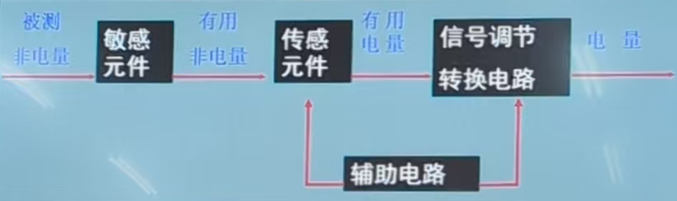

# 将军笔记

**加粗**的文本是重点（将军说的，应该吧）

---

## 物联网的定义

物联网是在互联网、移动通信网等通信网络的基础上，针对不同应用领域的需求，利用具有**感知**、**通信**与**计算**能力的智能物体自动获取物理世界的各种信息，将所有能够独立寻址的物理对象互联起来，实现**全面感知、可靠传输、智能处理**，构建人与物、物与物互联的智能信息服务系统。

---

## 物联网的主要特征

全面感知、可靠传输、智能处理

---

## 物联网的技术架构

1. **应用层**
    * 行业应用层
    * 管理服务层
2. **网络层**
    * 核心交换层
    * 汇聚层
    * 接入层
3. **感知层**

---

## 几种网的区别

1. 互联网：连接虚拟信息空间（信息挖掘与共享）
2. 传感网：连接现实物理世界（信息获取与感知）
3. 移动网：人人互联（网络中的客流）
4. 物联网：物物互联（网阔中的物流）
5. 泛在网：人与人、人与物、物与物，其最终形态包括互联网、移动网和物联网

---

## EAN-13码

标准码共13位数，系由“国家代码”3位数，“厂商代码”4位数，“产品代码”5位数，以及“检验码”1位数组成。其排列如下图：

---

## 二维条码的优势

|| 一维条码 | 二维条码 |
| --- | --- | --- |
| 资料密度与容量 | 密度低，容量小 | 密度高，容量大 |
| **错误侦测及自我纠正能力** | **可以检查码进行错误侦测，但没有错误纠错能力** | **有错误检验及错误纠错能力，并可根据实际应用设置不同的安全等级** |
| 垂直方向的资料 | 不储存资料，高度是为了识读方便，并弥补印刷缺陷或局部损坏 | 携带资料，因对印刷缺陷或局部损坏等可以错误纠正机制恢复资料 |
| **主要用途** | **主要用于对物品的标识** | **用于对物品的描述** |
| 资料库与网路依赖性 | 多数场合须依赖资料库及通讯网路的存在 | 可不依赖资料库及通讯网路的存在面单独应用 |
| 识读设备 | 可用线扫瞄器识读，如光笔、线型CCD、雷射枪 | 对于堆叠式可用型线扫描器的多次扫描，或可用图像扫描仪识读。矩阵式则仅能用图像扫描仪识读。 |

---

## RFID

RFID是**射频识别技术**（Radio Frequency Identification）的英文缩写，利用**射频信号**通过**空间耦合**（交变磁场或电磁场）实现**无接触信息传递**并通过所传递的信息达到**识别**目的。

它是上世纪90年代兴起的自动识别技术，首先在欧洲市场上得以使用，随后在世界范围内普及。

RFID较其它技术明显的**优点**是电子标签和阅读器**无需接触**便可完成识别。射频识别技术改变了条形码依靠“有形”的一维或二维几何图案来提供信息的方式，**通过芯片**来**提供存储**在其中的**数量巨大的“无形”信息**。

---

## CN、ISSN和ISBN

1. CN：CN是指中国国家图书编号，由字母“CN”和6位数字及分类号组成，CN为中国的国名代码，前2位数字为地区代码，后4位数字为地区连续出版物的序号，期刊的序号从1000至5999。
2. ISSN 是指国际标准连续出版物号码，以ISSN为前缀，由8位数字组成。8位数字分为前后两段各4位，中间用连接号相连，格式为ISSN XXXX-XXXX，前7位数字为顺序号，最后一位是校验位。
3. ISBN由10位数字组成，分四个部分：组号（国家、地区、语言的代号），出版者号，书序号和检验码。2007年1月1日起，实行新版ISBN，新版ISBN由13位数字组成，分为5段，即在原来的10位数字前加上3位EAN（欧洲商品编号）图书产品代码“978”。

---

## RFID标签的工作原理

---

## RFID标签的分类

1. 按照供电方式分类
    * 无源RFID标签
    * 有源RFID标签
2. 按照工作模式分类
    * 主动式RFID标签
    * 被动式RFID标签
    * 半主动式RFID标签
3. 按照读写方式分类
    * 只读式RFID标签
    * 读写式RFID标签
4. 按照工作频率分类
    * 低频RFID标签
    * 中高频RFID标签
    * 超高频RFID标签
    * 微波RFID标签

---

## 传感器的基本概念

传感器是由**敏感元件**和**转换元件**组成的一种检测装置，能感受到被测量，并能将检测和感受到的信息**按一定规律变换成电信号**输出，以满足信息的传输、处理、存储、显示、记录和控制的要求。

---

## 传感器的工作原理

---

## 传感器的分类（重点考按工作原理分类）

根据传感器的工作原理，可将其分为物理传感器、化学传感器两大类，生物传感器属于一类特殊的化学传感器。

### 物理传感器

| 分类 | 举例 |
| --- | --- |
| 力传感器 | 压力传感器、力矩传感器、速度传感器、加速度传感器、流量传感器、位移传感器、位置传感器、密度传感器、硬度传感器、粘度传感器 |
| 热传感器 | 温度传感器、热流传感器、热导率传感器 |
| 声传感器 | 声压传感器、噪声传感器、超声波传感器、声表面波传感器、次声波传感器 |
| 光传感器 | 可见光传感器、红外线传感器、紫外线传感器、图像传感器、光纤传感器、分布式光纤传感器 |
| 电传感器 | 电流传感器、电压传感器、电场强度传感器 |
| 磁传感器 | 磁场强度传感器、磁通量传感器 |
| 射线传感器 | X射线传感器、γ射线传感器、β射线传感器、辐射剂量传感器 |

### 化学传感器

离子传感器、气体传感器、湿度传感器、生物传感器

---

## 传感器的数学模型概述

从系统角度看，一种传感器就是一种系统。而一个系统总可以用一个数学方程式或函数来描述。即用某种方程式或函数表征传感器的**输出和输入的关系和特性**，从而，用这种关系指导对传感器的**设计、制造、校正和使用**。通常从传感器的静态输入-输出关系和动态输入-输出关系两方面建立数学模型。

---

## 传感器性能指标

线性度、灵敏度、分辨率、迟滞、重复性、漂移、测量范围、精度

---

## 嵌入式系统的概念

嵌入式系统也称作嵌入式计算机系统，它是一种专用的计算机系统。由于嵌入式系统需要**针对某些特定的应用**，因此研发人员需要**根据应用的具体需求，剪裁计算机的硬件与软件，以适应对计算机功能、可靠性、成本、体积、功耗的要求**。

---

## 智能穿戴设备进入春天需解决六大问题

1. 电池技术亟待升级
    * 电池微型化技术仍很欠缺
    * 在信息数据交互的过程中电耗是巨大的
2. 急需杀手级应用服务
    * 缺少“杀手级”应用
    * 实用性不足
    * 创新性不强
3. 用户使用习惯尚需培养
    * 功能应用与用户的常规需求贴合度较低
    * 不能满足消费者对智能穿戴设备的期望
4. 多为智能手机“配件”，独立性不强
5. 技术不成熟，尤其在健康和医疗相结合的领域
6. 费用昂贵、隐私性差

---

## 增强现实(AR) VS 虚拟现实(VR)

* VR强调的是**虚拟世界给人的沉浸感**，强调人能以自然方式与虚拟世界中的对象进行交互操作。
* AR则强调在**真实场景中融入计算机生成的虚拟信息的能力，它并不隔断观察者与真实世界之间的联系**。
* AR具有较低的硬件要求、更高的注册精度、更具真实感。

> 考试应该会考：AR的特点、VR的特点、两者的联系。

---

## 计算机网络的概念

* 网络介质：数据传输的**物理通道**，有**同轴电缆、双绞线、光纤、微波、卫星信道**等。
* 协议：网络设备间进行通信的一组**约定**。如**TCP/IP**等。网络协议具体规定了设备间通信的电气性能、数据组织方式等。
* 节点：网络中某分支的端点或网络中若千条分支的公共汇交点。
* 链路：是指两个相邻节点之间的通信线路。

---

## 计算机网络的分类

| 名称 | 缩写 | 范围 |
| --- | --- | --- |
| 个人局域网 | PAN | <10m |
| 局域网 | LAN | 10m-10km |
| 城域网 | MAN | 10km-100km |
| 广域网 | WAN | 100km-1000km |

---

## TCP/IP的三要素

语义、格式、时序

---

## TCP/IP的五层模型

| 协议 | 层 | 协议数据单元 |
| --- | --- | --- |
| Tenet、FTP、Email等 | 应用层 | 报文 |
| TCP和UDP | 传输层 | 数据段 |
| IP、ICMP和IGMP | 网络层 | 数据包 |
| 设备驱动程序及接口卡 | 链路层 | 帧 |
| 网络设备 | 物理层 | 比特 |

---

## 3G、4G、5G的特点

1. 3G
    * 3G支持高速语音与数据信号的混传，可以同时支持高速、实时数据业务，以及基本的语音业务。
    * 3G支持高速接入业务，室内数据传输速率可以达到2Mbps，在慢步步行时可以达到384kbps，在高速移动环境中可以达到144kbps。
    * 3G能够在全球范围内更好地实现无线漫游，提供网页浏览、电话会议、电子商务、音乐、视频等多种信息服务。
    * 3G也要考虑与已有2G系统的兼容性。
2. 4G
    * 4G能够以100Mbps的速度传输高质量的视频图像数据，通话只是4G手机一个基本的功能。
    * 4G终端可以实现一台便携式计算机、便携式电视机很多重要的功能。
    * 4G移动通信系统具备全球漫游、接口开放、终端多样化，能与2G、3G系统兼容。
    * **低速率 1Gbps、高延时 10ms、低连接 10万/km^2**
3. 5G
    * **大宽带，高速率 20GBPS、低时延 1ms、大连接 100万/km^2**