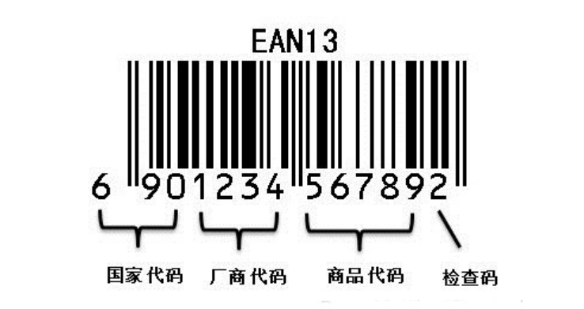
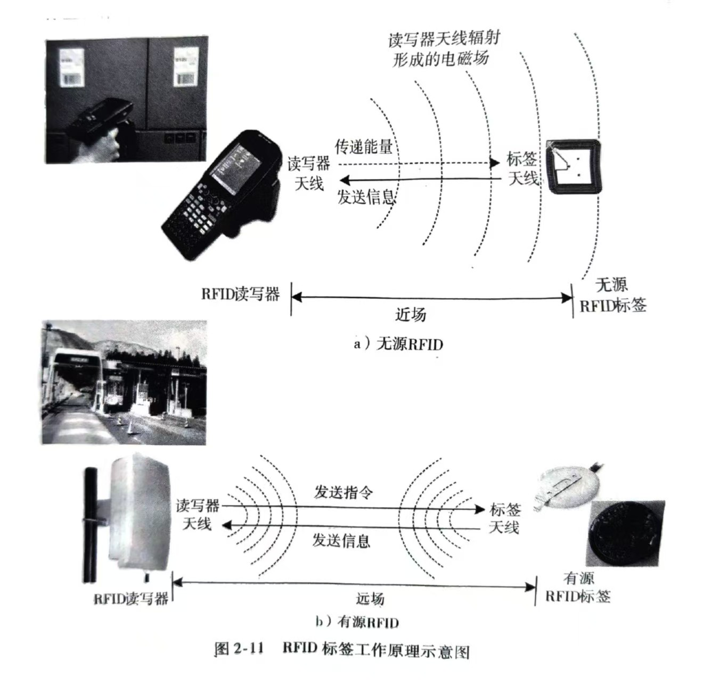

# 将军考点

---

## 物联网的定义

物联网是在互联网、移动通信网等通信网络的基础上，针对不同应用领域的需求，利用具有**感知**、**通信**与**计算**能力的智能物体自动获取物理世界的各种信息，将所有能够独立寻址的物理对象互联起来，实现**全面感知、可靠传输、智能处理**，构建人与物、物与物互联的智能信息服务系统。

---

## 物联网的主要特征

全面感知、可靠传输、智能处理

---

## 物联网的技术架构

1. **应用层**
    1. 行业应用层
    2. 管理服务层
2. **网络层**
    1. 核心交换层
    2. 汇聚层
    3. 接入层
3. **感知层**

---

## 几种网的区别

1. 互联网：连接虚拟信息空间（信息挖掘与共享）
2. 传感网：连接现实物理世界（信息获取与感知）
3. 移动网：人人互联（网络中的客流）
4. 物联网：物物互联（网阔中的物流）
5. 泛在网：人与人、人与物、物与物，其最终形态包括互联网、移动网和物联网

---

## EAN-13码

标准码共13位数，系由“国家代码”3位数，“厂商代码”4位数，“产品代码”5位数，以及“检验码”1位数组成。其排列如下图：

---

## 二维条码的优势

|| 一维条码 | 二维条码 |
| --- | --- | --- |
| 资料密度与容量 | 密度低，容量小 | 密度高，容量大 |
| **错误侦测及自我纠正能力** | **可以检查码进行错误侦测，但没有错误纠错能力** | **有错误检验及错误纠错能力，并可根据实际应用设置不同的安全等级** |
| 垂直方向的资料 | 不储存资料，高度是为了识读方便，并弥补印刷缺陷或局部损坏 | 携带资料，因对印刷缺陷或局部损坏等可以错误纠正机制恢复资料 |
| **主要用途** | **主要用于对物品的标识** | **用于对物品的描述** |
| 资料库与网路依赖性 | 多数场合须依赖资料库及通讯网路的存在 | 可不依赖资料库及通讯网路的存在面单独应用 |
| 识读设备 | 可用线扫瞄器识读，如光笔、线型CCD、雷射枪 | 对于堆叠式可用型线扫描器的多次扫描，或可用图像扫描仪识读。矩阵式则仅能用图像扫描仪识读。 |

---

## RFID

RFID是**射频识别技术**（Radio Frequency Identification）的英文缩写，利用**射频信号**通过**空间耦合**（交变磁场或电磁场）实现**无接触信息传递**并通过所传递的信息达到**识别**目的。

它是上世纪90年代兴起的自动识别技术，首先在欧洲市场上得以使用，随后在世界范围内普及。

RFID较其它技术明显的**优点**是电子标签和阅读器**无需接触**便可完成识别。射频识别技术改变了条形码依靠“有形”的一维或二维几何图案来提供信息的方式，**通过芯片**来**提供存储**在其中的**数量巨大的“无形”信息**。

---

## CN、ISSN和ISBN

1. CN：CN是指中国国家图书编号，由字母“CN”和6位数字及分类号组成，CN为中国的国名代码，前2位数字为地区代码，后4位数字为地区连续出版物的序号，期刊的序号从1000至5999。
2. ISSN 是指国际标准连续出版物号码，以ISSN为前缀，由8位数字组成。8位数字分为前后两段各4位，中间用连接号相连，格式为ISSN XXXX-XXXX，前7位数字为顺序号，最后一位是校验位。
3. ISBN由10位数字组成，分四个部分：组号（国家、地区、语言的代号），出版者号，书序号和检验码。2007年1月1日起，实行新版ISBN，新版ISBN由13位数字组成，分为5段，即在原来的10位数字前加上3位EAN（欧洲商品编号）图书产品代码“978”。

---

## RFID标签的工作原理

---

## RFID标签的分类

### 按照供电方式分类

* 无源RFID标签
* 有源RFID标签

### 按照工作模式分类

* 主动式RFID标签
* 被动式RFID标签
* 半主动式RFID标签

### 按照读写方式分类

* 只读式RFID标签
* 读写式RFID标签

### 按照工作频率分类

* 低频RFID标签
* 中高频RFID标签
* 超高频RFID标签
* 微波RFID标签

---

